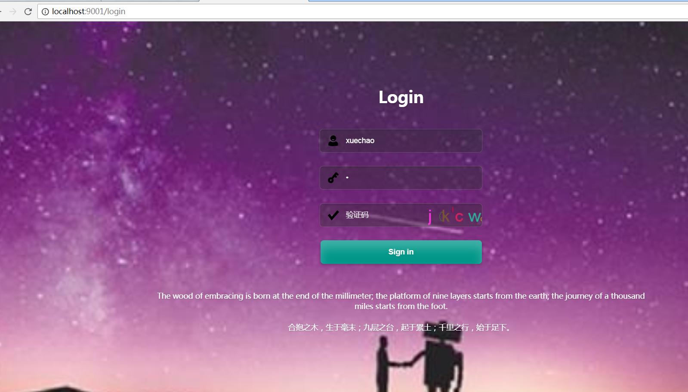
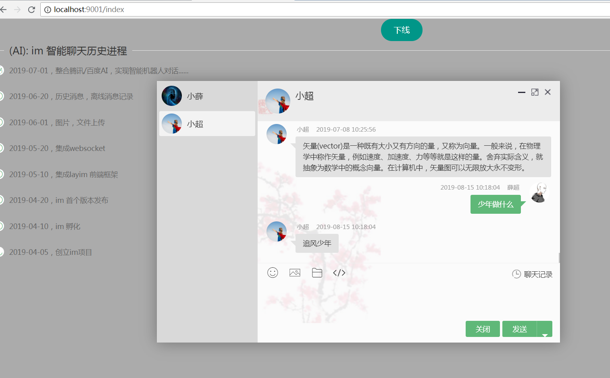
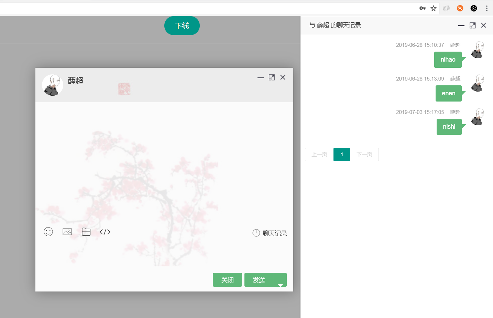
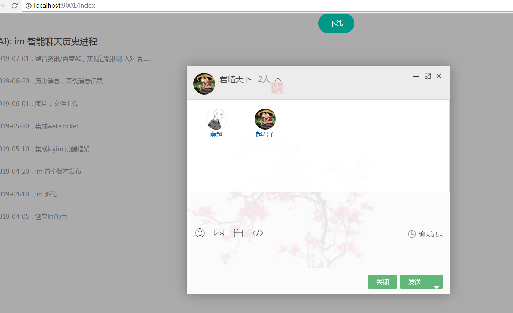
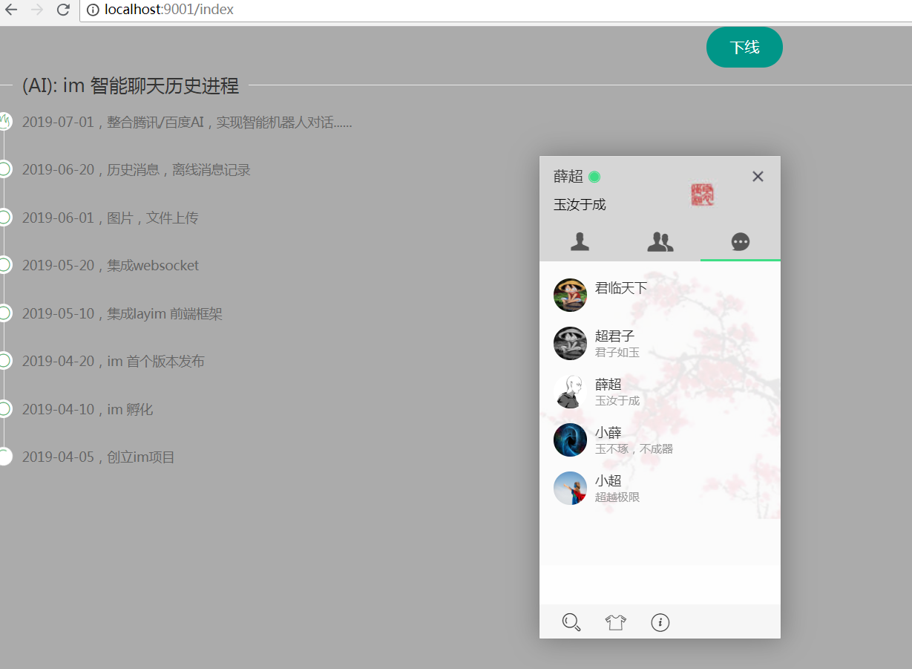
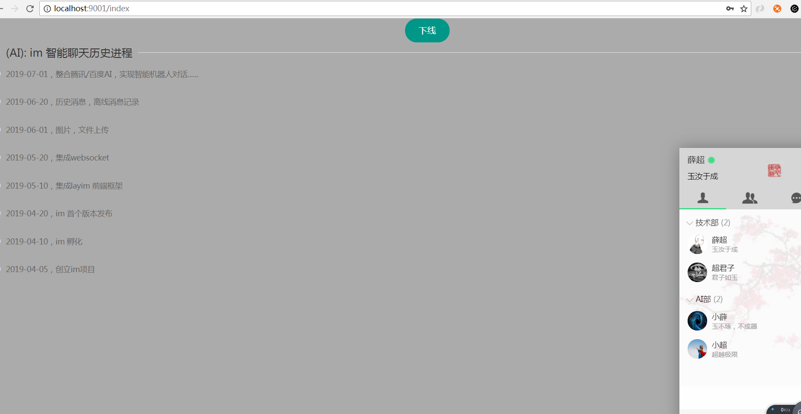
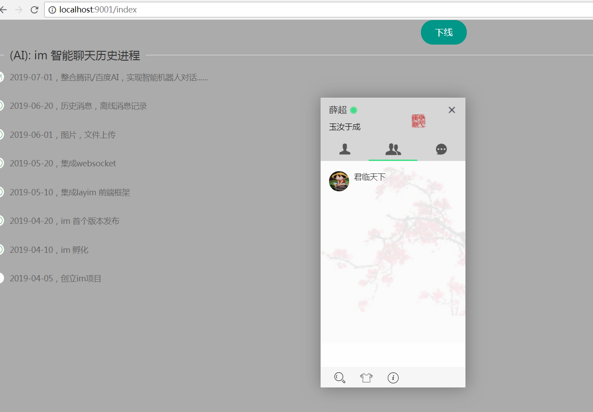
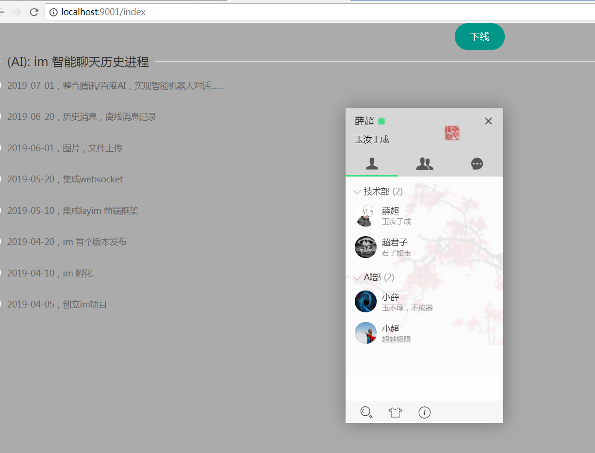
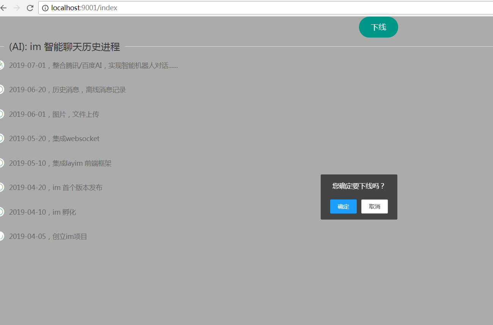

<p align="center">
  <a href="https://github.com/996icu/996.ICU/blob/master/LICENSE">
    
  </a>

  <a href="https://www.apache.org/licenses/LICENSE-2.0">
    
  </a>
</p>

# chao-cloud-im
spring-boot为基础，websocket+mybatis-plus+layui+layim+腾讯闲聊机器人+百度聊天机器人

## 集成

- [腾讯ai@申请](https://ai.qq.com/console/home)
- [百度ai@申请](http://ai.baidu.com/)

``` 
//1.导入sql
	resource
	  │
	  └─sql/mysql-im.sql
//2.修改 bootstrap.yaml 
		chao:
		  cloud:
		    im:
		      tai: #腾讯AI-机器人
		        app-id:  
		        app-key:  
		        session:  
		      bai: #百度Ai-机器人
		        app-id:  
		        api-key:  
		        secret-key:  
//3.引入layim.js
	resource
	  │
	  └─static   		 
	     └─layui 		
	   	  └─lay		
	 	     └─modules/layim.js
```

## 注意

- layim是收费UI，请大家自行前往官网授权
- 项目源代码中不包含layim.js包
- 拿去玩吧，禁止不授权使用，[贤心](https://github.com/sentsin)会找你的
- [LAYIM@官网](http://layim.layui.com/)

## 效果图展示


 
 
 
 
 
 
 
 

## 版权

### Apache License Version 2.0  

- 如不特殊注明，所有模块都以此协议授权使用。
- 任何使用了chao-cloud-im的全部或部分功能的项目、产品或文章等形式的成果必须显式注明chao-cloud-im。

### NPL (The 996 Prohibited License)

- 不允许 996 工作制度企业使用该开源软件

### LAYIM

- LayIM 受国家计算机软件著作权保护（登记号：2018SR064263）
- 未经官网正规渠道授权擅自公开产品源文件、和直接对产品二次出售的，将追究法律责任

### 鸣谢
- [java-sdk@百度AI](https://github.com/Baidu-AIP/java-sdk)  
- [xshuai@腾讯AI](https://gitee.com/xshuai/taip)  
- [hutool-超级工具类](https://github.com/looly/hutool)  
- [lombok](https://github.com/rzwitserloot/lombok)  
- [layim-js](https://gitee.com/pctao/instant_chat_tools)  
- [mybatis-plus](https://github.com/baomidou/mybatis-plus)  
- [layui](https://github.com/sentsin/layui/)  
- [......](https://github.com/)  

感谢诸位用户的关注和使用，chao-cloud-im并不完善，未来还恳求各位开源爱好者多多关照，提出宝贵意见。

作者 [@chaojunzi 1521515935@qq.com]

2019年8月15日